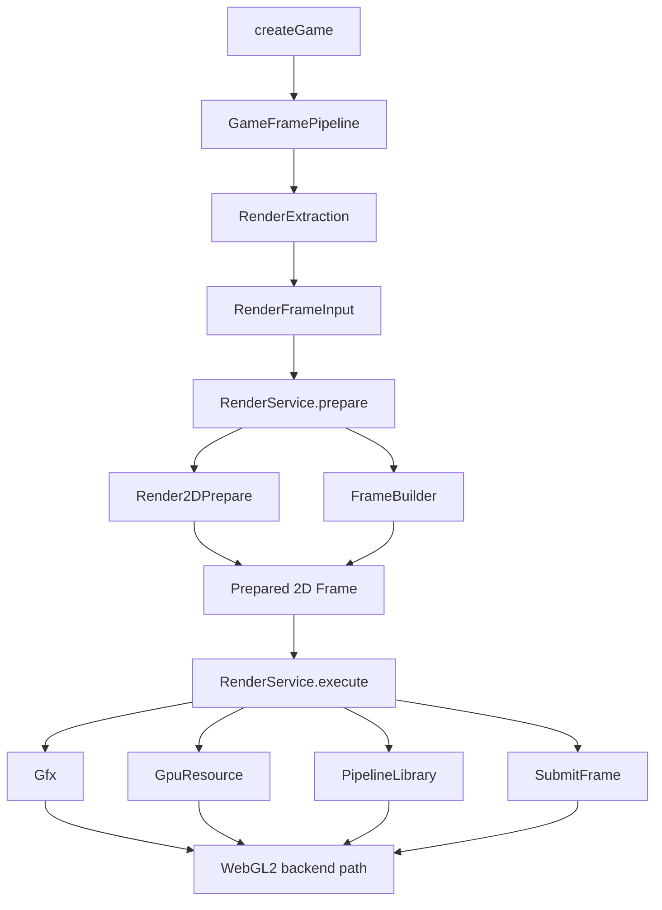

# Render Implementation Map

This map is for fast orientation. The stable public boundary is
`src/cluster/engine/services/render/index.ts`; everything below the render
package is implementation detail unless exported there.

## File Roles

- `service/Render.service.ts` owns lifecycle, resource registration,
  `prepare(...)`, `execute()`, and `RenderView` snapshots.
- `service/Render.types.ts` defines renderer-domain public input, resource,
  submit, stats, and view types.
- `modules/Render2DPrepare.module.ts` validates, sorts, interpolates, lowers,
  and batches 2D input.
- `modules/FrameBuilder.module.ts` owns frame-stat initialization.
- `modules/SubmitFrame.module.ts` submits prepared batches to the active backend.
- `gfxBackend/` owns graphics context acquisition, capability reads, and context
  loss state.
- `gpuResource/` owns renderer GPU handles, texture registration, uploads,
  fallback texture resolution, and transient buffers.
- `pipelineLibrary/` owns portable pipeline descriptors plus backend-specific
  program compilation/caching.

## Flow

Game orchestration owns render driving. During the render-preparation boundary,
game flushes and publishes world state, extracts renderer-domain input from
active scene stores, then calls `render.prepare(input)`. During render, game
calls `render.execute()`.

## Boundaries

- Public engine code should import from `src/cluster/engine/services/render`.
- Render public types must not import game, world, scene, manager, query,
  entity, or legacy render packages.
- Game may adapt current world rows into `RenderFrameInput`, but render must not
  know where that input came from.
- Authored systems do not receive a render phase or renderer internals.

## Test Map

- `render.public-surface.test.ts` protects the narrow barrel and sealed public
  types.
- `service/Render.service.test.ts` covers lifecycle, prepare/execute behavior,
  metrics, backend state, and debug errors.
- `modules/Render2DPrepare.module.test.ts` covers lowering, interpolation,
  ordering, batching, and validation.
- `modules/SubmitFrame.module.test.ts` covers backend submit reports and metrics.
- `gfxBackend`, `gpuResource`, and `pipelineLibrary` service tests cover private
  backend subservice behavior.
- `game/modules/RenderExtraction.module.test.ts` covers the game-owned adapter
  from current world rows to renderer-domain input.
- `game/modules/GameFramePipeline.module.test.ts` covers the game-owned
  prepare/execute ordering.

## Legacy Relationship

The legacy render directory is historical reference only. It can inform future
implementation details, but engine code must not import it.
